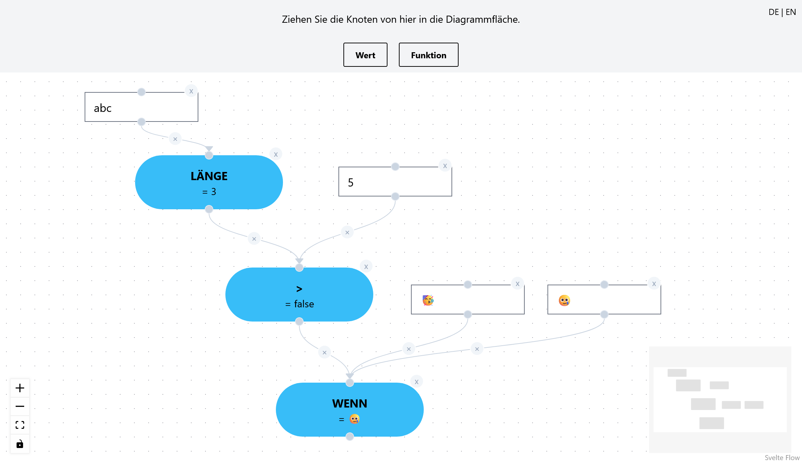

# Orinoco 2

An attempt at improving upon the original [Orinoco Online software](https://klassenkarte.de/orinoco-online/) for drawing data flow diagrams used in German computer science high school classes.

## How to run locally

1. Have a command line environment where you can run `docker compose`.
   - [official documentation on how to install Docker](https://docs.docker.com/get-started/get-docker/)
2. Download this repository to a directory in the environment from step 1.
3. Navigate to that directory in the command line.
4. Build and start the app with the command `docker-compose -f docker-compose.yaml -f docker-compose.override.build.yaml up`.
5. Use it in your browser at http://localhost:5173/en .

## How to develop with the target Docker environment

1. Make sure to follow steps 1. to 3. in the section above.
2. Build and start the app with the command `docker compose up`.
3. Edit your local copy of this repository with your favourite code editing software.
4. See the live changes at http://localhost:4173/en .

## Overall project architecture

This is a [SvelteKit](https://svelte.dev/docs/kit/introduction) project and therefore generally follows the structure required by that framework. A short overview:

- Most of the code that makes up the website's functionality can be found in `src/lib`.
- The user interface is made up of components of which the code can be found in `src/lib/components`.
- The functions which run in the app's function nodes are listed in `src/lib/nodeFunctions.ts`.
- I18n (internationalization) is encoded in the files in the `messages` directory
- The initial state of this project was created with a Docker container in order to avoid any problems with the `docker compose` environment further down the line. That project creation process is documented in `svelte-skeleton-creation`.
